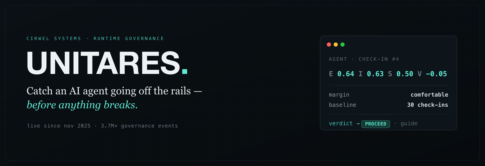

<div align="center">



### Runtime state, accountability, and recovery for long-lived AI-agent fleets.

</div>

Long-running agent work creates a continuity problem: every individual tool
call can be allowed while the process's claims, evidence, and behavior drift
apart over time.

**UNITARES is a self-hosted runtime accountability service for that gap.** At
meaningful checkpoints it binds writes to a process identity, records claims
beside available outcomes, estimates longitudinal state, returns a policy
action with a reason, and retains an audit trail plus searchable shared memory.
It is an MCP/HTTP service you run yourself — not an agent framework and not a
hosted platform. Plain-language definition: [What UNITARES is](docs/PRODUCT_DEFINITION.md).

**Status:** v2.19.0. The maintainer deployment has operated continuously since
November 2025, with 71,141 stored EISV state rows and six long-running resident
agents at the frozen snapshot. That establishes sustained single-operator
operation under real load: attributable records and exercised runtime paths.
Predictive utility, preventive benefit, and cross-operator generality are open.
[Evidence and limits](#evidence-and-limits) gives each claim its current
evidence class.

<div align="center">

[](https://github.com/cirwel/unitares/actions/workflows/tests.yml)
[](https://www.python.org/downloads/)
[](LICENSE)
[](https://doi.org/10.5281/zenodo.19647159)

[](#quickstart)
[](#evidence-and-limits)
[](docs/README.md)

</div>

---

## Quickstart

```bash
git clone --branch v2.19.0 --depth 1 https://github.com/cirwel/unitares.git
cd unitares
docker compose up -d --wait
make demo
```

This release-tagged Docker Compose flow is the supported install path for a
local, single-operator deployment. It brings up PostgreSQL/AGE/pgvector, Redis,
and the server on loopback without manual database initialization.

`make demo` onboards a fresh process and sends six check-ins over the real API,
printing the response shape, decision reason, state detail, and warmup position.
In about a minute the checkpoint loop is running against your own stack.

The dashboard is at `http://localhost:8767/dashboard`; MCP clients connect to
`http://localhost:8767/mcp/`.

Evaluating rather than installing? Start with [Evidence and limits](#evidence-and-limits)
and the [Reviewer Guide](docs/REVIEWER_GUIDE.md). For deployment and integration,
use the [user manual](docs/manual/README.md).

## What it does

At each checkpoint, UNITARES performs a small, explicit loop:

| Stage | Deployed contract |
|---|---|
| **Identity** | `start_session` binds later writes to a process instance. Reads can remain open; writes are proof-carrying when `STRICT_IDENTITY_REQUIRED` is set and auto-bound otherwise. See the [trust contract](docs/trust-contract.md). |
| **Claim and evidence** | `sync_state` records what the process says it did and its stated confidence. Tests, exit codes, reviews, and other outcome records can be associated with that claim, with their producer and provenance retained. |
| **State and policy** | The server updates longitudinal state and returns an action, reason, next step, and enforcement record. Graduated `guide` actions sit on the proceed side of the policy ladder. |
| **Enforcement and recovery** | A policy pause and an applied pause are separate facts. When a pause is applied on a governed write surface, later check-ins are refused until recovery succeeds; actions outside that surface remain the host's responsibility. |
| **Audit, memory, and review** | The process can store an attributed finding, request structured review, and leave the claim, evidence, policy, and recovery chain available for replay. |

The returned policy action, reason, next step, and enforcement record are the
stable integration boundary. EISV coordinates are diagnostic state estimates,
not an independent correctness verdict. A recorded pause proves neither that it
reached every host surface nor that pausing improved the eventual outcome.

Selected state values carry provenance labels. The metrics read surface enforces
label presence today; the full `measured` / `derived` / `prior` / `unknown`
vocabulary and wider coverage remain staged in the
[trust contract](docs/trust-contract.md).

Four optional surfaces build on the checkpoint record:

| Surface | What it adds |
|---|---|
| **Shared knowledge graph** | A provenance-aware store agents search before acting and write findings back to, with tagging, supersede, and archival lifecycle. |
| **Structured review** | Agents request review of each other's work; theses, disagreement, and resolution are recorded rather than resolved in chat. |
| **Reference resident agents** | Long-running sweep, audit, triage, and narration agents shipped as working examples, not as a framework to subclass. |
| **Elixir/OTP coordination** | Leases, handoffs, dispatch, and supervision for agents that outlive a single process. |

Identity binding makes stored findings, reviews, and leases attributable to a
process rather than a display label. Operators can inspect lifecycle, state,
evidence, and policy history through MCP/HTTP APIs and the self-hosted dashboard.
The public [`unitares-sdk`](agents/sdk/README.md) handles connection, identity,
check-ins, heartbeats, and knowledge participation for resident agents.

## Integrate an MCP client

`start_session` and `sync_state` are tools exposed by the connected UNITARES
server. A fresh process creates its own identity, then includes the returned
session binding on later writes:

```python
session = start_session(force_new=True)

result = sync_state(
    response_text=output,
    complexity=0.6,
    confidence=0.8,
    client_session_id=session["client_session_id"],
)

if result.get("success") is False:  # refused write, e.g. the agent is paused
    return_to_operator(result.get("recovery"))
elif result.get("state_summary", {}).get("action") == "pause":
    return_to_operator(result.get("next_action"))  # application-defined boundary
```

A returned `pause` policy and an applied write refusal are deliberately
separate in the response. `success=False` means the governed write was refused;
a returned pause on an accepted response still requires the host to honor the
action at any surface UNITARES does not control.

For a durable resident, preserve its identity anchor rather than minting a new
identity on every run; the [SDK lifecycle example](agents/sdk/README.md) handles
that continuity. Pair self-reported confidence with verifiable evidence whenever
possible:

| Need | Tool |
|---|---|
| Search shared memory before writing | `search_shared_memory(query=...)` |
| Record a test, task, or external outcome | `record_result(...)` |
| Request structured review | `request_review(issue_description=...)` |
| Read state without writing | `check_working_state()` |

When recording an outcome for a specific check-in, pass the `prediction_id`
from that check-in's response so the outcome grades that claim rather than an
unrelated earlier one.

`list_tools()` enumerates the complete live surface and
`describe_tool(tool_name=...)` explains any one tool. MCP, REST, the SDK, and host adapters use the same server;
Claude Code and Codex are supported clients, not server-side assumptions.

## How the runtime loop works

<div align="center">
  
</div>

At each checkpoint, the agent reports a meaningful unit of work and its stated
confidence. The server resolves the process identity, associates available
outcomes, updates longitudinal state, and returns a policy action with a named
reason. The retained record lets an operator audit both the claim and the basis
for the response.

Clients can treat the policy action, reason, and next step as the stable
contract. Operators can optionally inspect four EISV coordinates covering work
progress, evidence alignment, behavioral drift, and their balance. EISV is
proprioceptive state estimation: a read of how the process is working, drawn
from auditable, published heuristics. The
[computation reference](docs/EISV_COMPUTATION.md) documents formulas, warmup,
thresholds, and source code; the
[interpretation contract](docs/ontology/eisv-proprioception-contract.md) records
which readings are supported and which are not.

## Where it fits

UNITARES runs **alongside** evals, guardrails, and sandboxes; it replaces none of
them.

| Layer | Question | Timing |
|---|---|---|
| **Evals** | Is this model good enough for a defined task? | Before or between deployments. |
| **Guardrails / sandbox** | Is this action allowed and contained? | Per action. |
| **UNITARES** | What has this running process been doing, what evidence supports its claims, and what state is it in now? | Continuously, mid-run. |

It is designed for long-lived coding, research, operations, monitoring, and
multi-agent processes that can instrument a check-in loop. It is usually not
worth the overhead for short-lived chat turns.

UNITARES is a state instrument, not an outcome oracle: it
does not decide whether an output is correct or ethical, and it
cannot detect deliberate concealment without independent evidence. The
[scope and threat model](docs/SCOPE_AND_THREAT_MODEL.md) draws that boundary
precisely. The mathematical formulation in the companion paper is a parallel
research path, not the deployed policy mechanism.

## Local control and future federation

UNITARES is self-hosted and single-operator by design: identity, telemetry,
evidence, and policy history stay on infrastructure you control, with no
outbound dependency on a vendor service.

The architecture also exposes the seams a later federation experiment would
need: process-bound identity, evidence provenance, a
[versioned telemetry envelope](docs/ontology/eisv-telemetry-envelope-v1.md), and
policy decisions with named reasons. Whether those records suffice to exchange
cross-operator attestations without centralizing raw telemetry is an open
question on the **multi-principal trust** track in the [roadmap](ROADMAP.md);
cross-governor trust, consensus, and enforcement are not deployed guarantees
today.

## Evidence and limits

UNITARES separates operational observations, benchmark decisions, and
scientific inferences. An evidence class says what a result licenses; it is not
a positive or negative judgement about the project.

| Evidence class | What it licenses |
|---|---|
| **Operational observation** | A named mechanism ran in the stated deployment. It does not establish benefit, correctness, or generality. |
| **Benchmark pass / fail** | An artifact met or missed a fixed criterion. The result applies to that benchmark and operational decision, not automatically to a broader capability claim. |
| **Non-detection** | The test did not separate the candidate from its comparison. Without adequate power, it establishes neither absence nor a useful ceiling. |
| **Unidentified / inconclusive** | The design lacks the target match, counterfactual, independent unit, support, power, or protocol needed for the named inference. |
| **Mismatch / path bound** | Source, formula, provenance, documentation, or control-flow inspection established a concrete engineering fact. |
| **Untested** | No suitable measurement has been made. |

A registered operational `FAIL` can close a scheduled line of work without
scientifically refuting the underlying capability. A claim earns `REFUTED` only
when the target, counterfactual, independent unit, support and power, decision
rule, and read protocol all support that conclusion. The
[inference-status contract](docs/ontology/falsification-inference-containment-2026-08-22.md)
defines those boundaries.

At the [2026-08-11 frozen snapshot](docs/PRODUCTION_SNAPSHOT.md), the maintainer
deployment provided operational evidence that the system runs at length under
real load:

| Evidence | Scope |
|---|---|
| **4,573,890 audit/telemetry events** | Continuous maintainer-run operation since 2025-11-28, the first identity record. Session-resolution observations and cross-device-call records make up 91.4%. Measures infrastructure load and uptime. |
| **71,141 stored EISV state rows** | Longitudinal state observations in `core.agent_state`. The unit is the observation; the fleet producing them is the six residents below. |
| **15 recorded self-recovery events** | Of 21 canonical, non-automatic lifecycle-resume records. Shows the recovery path was exercised. |
| **32,181 labeled EISV windows** | [20,655 overlapping real windows from one 39-day Raspberry Pi run plus 11,526 synthetic windows](https://huggingface.co/datasets/hikewa/unitares-eisv-trajectories). Window parameters, the real/synthetic split (a per-row `provenance` column), and the generating pipeline are documented on the dataset card and indexed in the [evaluation catalog](docs/EVALUATION_INDEX.md#labelled-sets). The unit is the window; every real window comes from the single Raspberry Pi run named above. |
| **6 long-running resident agents** | Configured and operating in the maintainer deployment at the snapshot date; one runs on separate hardware, the same Raspberry Pi that produced the labeled-window dataset. The same single-operator fleet as every number above. |

The maintainer deployment is **single-operator and co-development dogfood**: most
agents governed by the system are also building the system. Read
[`DEPLOYMENT_DATA_CAVEAT.md`](docs/operations/DEPLOYMENT_DATA_CAVEAT.md) before
citing a fleet number.

### Current claim status

| Question | Current status | What the record supports |
|---|---|---|
| Sustained operation | **Operational observation** | The maintainer deployment has run continuously under real load. The counts above are rows, events, and configured residents. |
| Identity and audit trail | **Exercised path** | Process-bound writes, evidence records, policy responses, and replayable audit history are deployed. This establishes mechanism execution. |
| Pause actuation and delivery | **Event reconciled; protection untested** | A governed pause landed on 2026-08-09. At the 2026-08-06 audit, a cadence window had downgraded 195 of 218 recorded pauses (89.4%) before delivery; the current rate has not been re-measured. See [ledger rows 24, 27, and 28](docs/ontology/eisv-proprioception-contract.md). |
| Predictive lift | **Non-detection; inconclusive for weak effects** | In the frozen 2026-08-09 cohort, no slice cleared the selection-aware null (selective p = 0.070–0.567). The [power audit](docs/operations/falsifiability-power-audit-2026-08-23.md) estimates roughly 3% power against a weak effect on a cohort of that shape, so the result sets no standing AUC ceiling. |
| Incident prevention or benefit from pausing | **Untested** | No governed-versus-ungoverned comparison has shown an incident prevented or an outcome improved by pausing. |
| Behavior change from review and coordination | **Untested** | The system records that review and coordination ran and what they concluded; downstream behavioral effect has not been measured. |
| Robustness to a motivated attacker | **Structural limit** | A capable process can optimize or conceal behavior outside the monitored proxy; independent evidence remains necessary. See the [scope and threat model](docs/SCOPE_AND_THREAT_MODEL.md). |
| Cross-operator generality | **Untested** | Every deployment number above comes from one operator's co-development fleet. |

The outcome read also has a protocol qualification. After the frozen cutoff,
recurring automation exposed live discrimination output: the ablation watchdog
completed 42 of 51 executions and the dogfood guard completed 43 of 52. Those
jobs are paused. The fixed
[2026-12-01 gate](docs/proposals/eisv-outcome-grounding-stop-rule-v0.md) remains
an operational decision rule, but it is not the only post-registration read and
cannot be described as clean single-read blinding. Its report must disclose the
interim access and read-specific power. An operational `FAIL` may close further
scheduled outcome-grounding work; inadequate support or an underpowered
non-detection remains scientifically inconclusive.

The instrument-frame validation the system does claim — reliability,
faithfulness under intervention, calibration — is scoped and partly built; the
[roadmap](ROADMAP.md) tracks it. The companion DOI identifies a
[public preprint](https://doi.org/10.5281/zenodo.19647159), not peer-reviewed
validation.

## Architecture, setup, and documentation

**Python 3.12+ · PostgreSQL + AGE + pgvector · Redis · optional Elixir/OTP
coordination.** Redis holds session and identity state, and the Docker
quickstart brings it up. The server starts without it in a degraded local-only
mode, which is not the supported path.

| Reader | Start here |
|---|---|
| Evaluator or grant reviewer | [Reviewer Guide](docs/REVIEWER_GUIDE.md) → [computation](docs/EISV_COMPUTATION.md) → [scope and threat model](docs/SCOPE_AND_THREAT_MODEL.md) |
| Integrator | [Manual](docs/manual/README.md) → [MCP clients](docs/integration/MCP_CLIENTS.md) |
| Operator | [Docker quickstart](#quickstart) → [operator runbook](docs/operations/OPERATOR_RUNBOOK.md); [bare-metal playbook](docs/install/PLAYBOOK.md) for advanced macOS installs |
| Contributor | [AGENTS.md](AGENTS.md) → [architecture](docs/UNIFIED_ARCHITECTURE.md) → [canonical sources](docs/dev/CANONICAL_SOURCES.md) |
| Research/provenance reader | [Evaluation index](docs/EVALUATION_INDEX.md) → [ontology](docs/ontology/README.md) → [proposals](docs/proposals/README.md) |

The complete documentation map is [`docs/README.md`](docs/README.md). Optional
analogies and philosophical readings are isolated under
[`docs/essays/`](docs/essays/README.md); they are not specifications or evidence.

Project operation is explicit: see the [roadmap](ROADMAP.md),
[compatibility and naming map](COMPATIBILITY.md), [governance](GOVERNANCE.md),
[contributing guide](CONTRIBUTING.md), [security policy](SECURITY.md),
[support policy](SUPPORT.md), and [release process](docs/operations/RELEASE_PROCESS.md).

## Ecosystem repositories

These are adjacent integrations, testbeds, and research projects; the core
quickstart does not require them.

| Project | Role |
|---|---|
| [anima-mcp](https://github.com/cirwel/anima-mcp) | Raspberry Pi longitudinal testbed. |
| [unitares-governance-plugin](https://github.com/cirwel/unitares-governance-plugin) | Codex and Claude Code lifecycle/hook packaging. |
| [unitares-host-adapter](https://github.com/cirwel/unitares-host-adapter) | Thin bindings for additional clients and model hosts. |
| [fermata](https://github.com/cirwel/fermata) | Governed-effect runtime research seed. |
| [eisv-lumen](https://github.com/cirwel/eisv-lumen) | Dataset generation and labeling pipeline. |
| [unitares-paper-v6](https://github.com/cirwel/unitares-paper-v6) | Companion preprint and research formulation. |

## Citation and license

Kenny Wang ([ORCID 0009-0006-7544-2374](https://orcid.org/0009-0006-7544-2374)),
CIRWEL Systems. See [`CITATION.cff`](CITATION.cff) for the versioned citation.
The DOI below identifies a public preprint, not peer-reviewed validation — see
[Evidence and limits](#evidence-and-limits).

```bibtex
@misc{wang2026unitares,
  author = {Wang, Kenny},
  title  = {{UNITARES}: Information-Theoretic Governance of Heterogeneous Agent Fleets},
  year   = {2026},
  doi    = {10.5281/zenodo.19647159}
}
```

Apache License 2.0 — see [LICENSE](LICENSE) and [NOTICE](NOTICE).
