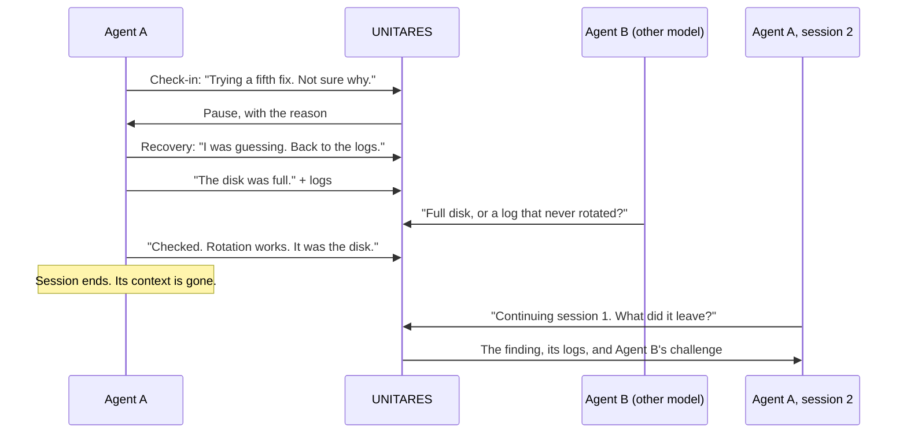

<div align="center">

<picture>
  <source media="(prefers-color-scheme: dark)" srcset="docs/assets/unitares-lockup-dark.svg">
  
</picture>

### Accountability infrastructure for long-running AI agents.

Give every process an identity. Keep claims, evidence, reviews, and outcomes
connected. Recover work across restarts, context loss, and handoffs.

[](https://github.com/cirwel/unitares/actions/workflows/tests.yml)
[](https://www.python.org/downloads/)
[](LICENSE)
[](https://doi.org/10.5281/zenodo.19647159)

</div>

## Your agents forget. UNITARES remembers who did what.

An agent spends the night working out why a backup failed. By morning its
session has restarted, its context is gone, and another process has taken over.
What did it find? What backs that up? Who challenged it? None of that is a
commit, so your repository never sees it.

With UNITARES, agents check in as they work, and the record outlives them:


```mermaid
sequenceDiagram
    participant A as Agent A
    participant U as UNITARES
    participant B as Agent B (other model)
    participant A2 as Agent A, session 2
    A->>U: Check-in: "Trying a fifth fix. Not sure why."
    U->>A: Pause, with the reason
    A->>U: Recovery: "I was guessing. Back to the logs."
    A->>U: "The disk was full." + logs
    B->>U: "Full disk, or a log that never rotated?"
    A->>U: "Checked. Rotation works. It was the disk."
    Note over A: Session ends. Its context is gone.
    A2->>U: "Continuing session 1. What did it leave?"
    U->>A2: The finding, its logs, and Agent B's challenge
```

## Start with one thing

Start with the first layer and add the next when you need it. Each process calls
`start_session(force_new=true)` once and reuses its `client_session_id` after that.

| Start here | You get | Tools |
|---|---|---|
| **1. Remember** | Every process has a name, and what it finds survives restarts and handoffs. | `start_session`, `store_finding`, `search_shared_memory` |
| **2. Challenge** | Open a review on the record. A peer agent or a reviewer model you configure answers it, and any disagreement stays with the work. | `request_review` |
| **3. Steer** | Check-ins return proceed, guide, or pause with a reason, and outcomes are recorded against them. | `sync_state`, `record_result` |

## What UNITARES is

UNITARES is self-hosted accountability infrastructure for operators running
multiple AI agents. Its federation kernel connects independent runtimes to one
operator-controlled server over MCP or HTTP, where they share a durable record
while keeping their own models, tools, and runtimes. They interoperate with
each other over their own transports or A2A; UNITARES is the record behind
them, not the transport between them.

Agent work remains attributable, reviewable, and recoverable even when the
process that started it is gone.

## What UNITARES gives you

- **Identity and lineage** — know which process acted and where inherited work
  came from. This is a record for attribution, not a credential; platform
  workload identity remains the credential layer.
- **Claims and evidence** — retain important findings, corrections, and their
  provenance outside any one context window.
- **Governed review** — preserve disagreement, conditions, and resolution as
  part of the work record.
- **Outcome grounding** — connect predictions and check-ins to what later
  happened.
- **Runtime policy** — return an action, reason, and next step at meaningful
  checkpoints in an agent's loop.
- **Reconstruction** — give a successor the records needed to understand and
  continue earlier work.

Measured results and their evidence status are in the
[claim ledger](docs/EVIDENCE_AND_LIMITS.md).

## Install

With Git, curl, and Docker Compose installed, one command starts the latest
verified release of the local operator stack:

```bash
v=$(curl -fsSL https://raw.githubusercontent.com/cirwel/unitares/master/PUBLISHED_VERSION) && git clone --branch "v$v" --depth 1 https://github.com/cirwel/unitares.git && cd unitares && docker compose up -d --wait
```

Connect MCP clients at `http://localhost:8767/mcp/` or open the dashboard at
`http://localhost:8767/dashboard`.

This provisions the server, PostgreSQL with AGE and pgvector, Redis, and the
coordination plane.

## How it works

The server runs alongside evals, sandboxes, and guardrails. It provides the
continuity and accountability layer that connects their outputs over time.
Core storage is self-hosted and runs on its own; the operator chooses which
inference providers and integrations to connect.

Its EISV state model is runtime [proprioception](docs/ontology/eisv-proprioception-contract.md):
a way to make changes in an agent process visible so operators can diagnose and
act on them with evidence.

## Where it is going

UNITARES is working toward an operator experience where a fleet can be brought
under accountable operation in one step: identities are configured, handoffs
are enforceable, important evidence survives, reviews bind to the work they
govern, and outcomes are recorded where the next decision can use them.

The larger aim is infrastructure for agent systems that can accumulate useful
experience without losing authorship, challenge, or operational control as they
grow.

## Start here

| Goal | Guide |
|---|---|
| Operate a deployment | [Operator manual](docs/manual/README.md) |
| Connect an agent or application | [MCP integration](docs/integration/MCP_CLIENTS.md) · [Python SDK](agents/sdk/README.md) |
| Understand the product and architecture | [Product definition](docs/PRODUCT_DEFINITION.md) · [Architecture](docs/UNIFIED_ARCHITECTURE.md) |
| Evaluate the claims | [Evidence and limits](docs/EVIDENCE_AND_LIMITS.md) · [Reviewer Guide](docs/REVIEWER_GUIDE.md) · [Public dataset](https://huggingface.co/datasets/hikewa/unitares-eisv-trajectories) |
| Contribute | [Contributing](.github/CONTRIBUTING.md) · [Development guide](AGENTS.md) |

The [documentation index](docs/README.md) covers deployment profiles,
operations, security, compatibility, research, and the full tool surface.

## Ecosystem

UNITARES works with the
[governance plugin](https://github.com/cirwel/unitares-governance-plugin) for
Codex and Claude Code, the public [Python SDK](agents/sdk/README.md), and the
[resident agent runtime](https://github.com/cirwel/unitares-resident). These are
separate userlands connected by the same operator-owned record.

## Citation and license

Kenny Wang ([ORCID 0009-0006-7544-2374](https://orcid.org/0009-0006-7544-2374)),
CIRWEL Systems. See [`CITATION.cff`](CITATION.cff) for the versioned citation.

```bibtex
@misc{wang2026unitares,
  author = {Wang, Kenny},
  title  = {{UNITARES}: Information-Theoretic Governance of Heterogeneous Agent Fleets},
  year   = {2026},
  doi    = {10.5281/zenodo.19647159}
}
```

Apache License 2.0. See [LICENSE](LICENSE) and [NOTICE](NOTICE).
