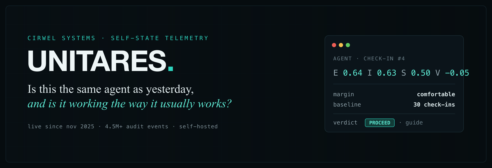

<div align="center">



### Coordination and self-state telemetry for long-lived AI-agent fleets.

</div>

An agent that runs for weeks is not the same kind of object as a chat turn. It
accumulates claims, drifts, restarts, and gets replaced by a fresh process
wearing the same display name. Every individual tool call can be permitted while
the process as a whole comes apart.

Evals ask whether a model is good enough for a task. Guardrails ask whether one
action is allowed. Traces record what a single run did. None of them answer the
question an operator running a fleet actually has:

> **Is this the same agent as yesterday, and is it working the way it usually
> works?**

At each checkpoint UNITARES binds the write to a process identity, records what
the agent claims alongside whatever evidence exists, updates a longitudinal state
estimate, and returns a policy action with a named reason. The whole chain stays
replayable, and two live processes can contend for the same governed surface
without silently colliding.

Self-hosted and single-operator by design. MCP is the primary agent-facing
interface; REST, the public SDK, host adapters, and the dashboard expose the same
core. Plain-language definition:
[What UNITARES is](docs/PRODUCT_DEFINITION.md).

**Status:** v2.21.0. Running continuously since November 2025.
[Evidence and limits](#evidence-and-limits) gives every claim its evidence class,
including the open ones.

<div align="center">

[](https://github.com/cirwel/unitares/actions/workflows/tests.yml)
[](https://www.python.org/downloads/)
[](LICENSE)
[](https://doi.org/10.5281/zenodo.19647159)

[](#quickstart)
[](#evidence-and-limits)
[](docs/README.md)

</div>

---

## Quickstart

```bash
git clone --branch v2.21.0 --depth 1 https://github.com/cirwel/unitares.git
cd unitares
docker compose up -d --wait
make coordination-demo
```

This release-tagged Docker Compose flow is the supported install path for a
local, single-operator deployment. It brings up PostgreSQL/AGE/pgvector, Redis,
the lease plane, and the server on loopback without manual database
initialization. After cloning, the one-command install/start is
`docker compose up -d --wait`.

`make coordination-demo` gives the first observable result: two participants
onboard through governance; governance exchanges their continuity credentials
for single-use, request-bound Ed25519 attestations; A's attestation is refused
when it claims B's UUID; a captured attestation is refused on replay; and one
governed `maintenance:/` surface moves through an identity-checked atomic
handoff before release. The printed receipt also names the boundary: clients
must participate in the lease plane, and this local demo does not exercise a
second operator or establish improved outcomes.

To exercise longitudinal state next, run `make demo`. It onboards a fresh
process and sends six check-ins over the real API, printing the response shape,
decision reason, state detail, and warmup position.

The dashboard is at `http://localhost:8767/dashboard`; MCP clients connect to
`http://localhost:8767/mcp/`; the lease plane listens on
`http://127.0.0.1:8788` with bearer auth.

Evaluating rather than installing? Start with
[Evidence and limits](#evidence-and-limits) and the
[Reviewer Guide](docs/REVIEWER_GUIDE.md). For deployment and integration, use the
[user manual](docs/manual/README.md).

## The checkpoint loop

Everything else in this repository is built on one small, explicit loop.

| Stage | Deployed contract |
|---|---|
| **Identity** | `start_session` binds later writes to a process instance. Reads can remain open; writes are proof-carrying when `STRICT_IDENTITY_REQUIRED` is set and auto-bound otherwise. See the [trust contract](docs/trust-contract.md). |
| **Claim and evidence** | `sync_state` records what the process says it did and its stated confidence. Tests, exit codes, reviews, and other outcome records can be associated with that claim, with their producer and provenance retained. |
| **State and policy** | The server updates longitudinal state and returns an action, reason, next step, and enforcement record. Graduated `guide` actions sit on the proceed side of the policy ladder. |
| **Enforcement and recovery** | A policy pause and an applied pause are separate facts. When a pause is applied on a governed write surface, later check-ins are refused until recovery succeeds; actions outside that surface remain the host's responsibility. |
| **Audit, memory, and review** | The process can store an attributed finding, request structured review, and leave the claim, evidence, policy, and recovery chain available for replay. |

The returned policy action, reason, next step, and enforcement record are the
stable integration boundary.

Four optional surfaces build on that record:

| Surface | What it adds |
|---|---|
| **Shared knowledge graph** | A provenance-aware store agents search before acting and write findings back to, with tagging, supersede, and archival lifecycle. |
| **Structured review** | Agents request review of each other's work; theses, disagreement, and resolution are recorded rather than resolved in chat. |
| **Reference resident agents** | Long-running sweep, audit, triage, and narration agents shipped as working examples. |
| **Elixir/OTP coordination** | Leases, handoffs, dispatch, and supervision for agents that outlive a single process. |

Identity binding is what makes stored findings, reviews, and leases attributable
to a process rather than to a display label. The Docker quickstart enforces this
for `maintenance:/` leases; other kinds remain staged until all of their
producers carry proofs. Governance keeps the continuity credential and private
signing key; the lease plane verifies a short-lived token bound to a
deployment-specific audience plus the exact method, path, and request-body
hash, then consumes its nonce once. This version accepts one explicitly trusted
issuer. Multi-issuer federation remains blocked until lease principals persist
both issuer and subject; active leases must be drained before changing issuer.
`legacy`, `hybrid`, and `attestation` proof modes
support staged upgrades.
Operators inspect lifecycle, state, evidence, and policy history through
MCP/HTTP APIs and the self-hosted dashboard.
The public [`unitares-sdk`](agents/sdk/README.md) handles connection, identity,
check-ins, heartbeats, and knowledge participation for resident agents.

## Where it fits

UNITARES runs **alongside** evals, guardrails, and sandboxes. It replaces none of
them.

| Layer | Question | Timing |
|---|---|---|
| **Evals** | Is this model good enough for a defined task? | Before or between deployments. |
| **Guardrails / sandbox** | Is this action allowed and contained? | Per action. |
| **UNITARES** | What has this running process been doing, what evidence supports its claims, and what state is it in now? | Continuously, mid-run. |

It is built for long-lived coding, research, operations, monitoring, and
multi-agent processes that can instrument a check-in loop, and is usually not
worth the overhead for short-lived chat turns.

UNITARES is a state instrument, not an outcome oracle. It
does not decide whether an output is correct or ethical, and it
cannot detect deliberate concealment without independent evidence. The
[scope and threat model](docs/SCOPE_AND_THREAT_MODEL.md) draws that boundary
precisely.

It governs the agent's loop from outside rather than owning it, so Claude Code,
Codex, Hermes, custom runtimes, and resident agents stay different userlands
while sharing one accountable record and policy surface.

| Layer | Responsibility | Status |
|---|---|---|
| **UNITARES Core** | Identity, provenance, longitudinal state, policy and recovery, audit, knowledge, dialectic review, and coordination. | Shipped in this repository. |
| **Public interfaces** | MCP as the primary agent-facing contract, plus REST, `unitares-sdk`, the dashboard, plugins, and host adapters. The versioned [interface contract](docs/INTERFACE_CONTRACT.md) defines the common tool-discovery seam. | Shipped; individual surfaces have their own maturity limits. |
| **Agent userlands** | The conversational loop, model/provider selection, tool execution, scheduling, and user interaction. | Supplied by external harnesses and custom clients today. |
| **UNITARES Resident** | A first-party, general-purpose agent userland built entirely on the public interfaces above. | Early runtime skeleton in [`unitares-resident`](https://github.com/cirwel/unitares-resident), not yet a usable general-purpose agent. It lives outside Core and imports no Core internals. |

The lowercase residents under [`agents/`](agents/README.md) are reference
clients and operational examples, not the Resident product and not a framework
to subclass.

## Integrate an MCP client

`start_session` and `sync_state` are tools exposed by the connected UNITARES
server. A fresh process creates its own identity, then includes the returned
session binding on later writes:

```python
session = start_session(force_new=True)

result = sync_state(
    response_text=output,
    complexity=0.6,
    confidence=0.8,
    client_session_id=session["client_session_id"],
)

if result.get("success") is False:  # refused write, e.g. the agent is paused
    return_to_operator(result.get("recovery"))
elif result.get("state_summary", {}).get("action") == "pause":
    return_to_operator(result.get("next_action"))  # application-defined boundary
```

`success=False` means the governed write was refused. A pause returned on an
accepted response is the host's to honor, at surfaces UNITARES does not own.

For a durable resident, preserve its identity anchor rather than minting a new
identity on every run; the [SDK lifecycle example](agents/sdk/README.md) handles
that continuity. Pair self-reported confidence with verifiable evidence wherever
possible:

| Need | Tool |
|---|---|
| Search shared memory before writing | `search_shared_memory(query=...)` |
| Record a test, task, or external outcome | `record_result(...)` |
| Ask a model for advisory help | `consult(brief=..., purpose=...)` |
| Request governed, on-record review | `request_review(issue_description=...)` |
| Read state without writing | `check_working_state()` |

See the [advisory consultation facade proposal](docs/proposals/consult-advisory-facade-v1.md)
for the routing, privacy, and authority contract behind `consult`.

When recording an outcome for a specific check-in, pass the `prediction_id` from
that check-in's response so the outcome grades that claim rather than an
unrelated earlier one.

`list_tools()` enumerates the complete live surface and
`describe_tool(tool_name=...)` explains any one tool. MCP, REST, the SDK, and host
adapters all reach the same server.

## How the runtime loop works

<div align="center">
  
</div>

Clients can treat the policy action, reason, and next step as the stable
contract. Operators can optionally inspect four EISV coordinates covering work progress,
evidence alignment, behavioral drift, and their balance. EISV is self-state
estimation: a read of how the process is working, drawn from auditable,
published heuristics. The
[computation reference](docs/EISV_COMPUTATION.md) documents formulas, warmup,
thresholds, and source code; the
[interpretation contract](docs/ontology/eisv-proprioception-contract.md) records
which readings are supported and which are not.

## Local control and future federation

Identity, telemetry, evidence, and policy history stay on infrastructure you
control, with no outbound dependency on a vendor service.

The architecture exposes several of the seams a later federation experiment
would need: process-bound identity, evidence provenance, a
[versioned telemetry envelope](docs/ontology/eisv-telemetry-envelope-v1.md), and
policy decisions with named reasons.

**The blocker is named, not unknown.** Resolution attestations are HMAC keyed on
each agent's api_key. That is symmetric: a verifier needs the signing key, and
holding it would also let them forge a signature. Sound for its deployed purpose
of one operator attesting inside their own trust boundary, and explicitly not
non-repudiation. Asymmetric or DPoP-style keys were considered and shelved on
2026-04-19, so until that is revisited a record from this system cannot be
verified by an operator who does not already trust its issuer, which is the whole
problem a federation exchange has to solve. Whether the remaining records suffice
to exchange cross-operator attestations without centralizing raw telemetry is
open on the **multi-principal trust** track in the [roadmap](ROADMAP.md).

## What is built

One operator, since 2025-11-20. The counts below are structural facts about this
repository and its companions, not a claim that any of it outperforms an
alternative. They answer one question an evaluator reasonably asks first: is this
a prototype or a system?

| | |
|---|---|
| **106 MCP tools** | identity, state, knowledge, review, coordination, inference routing, and admin surfaces, all discoverable through `list_tools()` |
| **12,619 test functions** | across 720 files, sharded in CI, with the fleet-neutrality and evidence contracts enforced as tests rather than as conventions |
| **64 database migrations** | slot-and-name drift is gated by the repo doctor |
| **509 Python modules** | `src/`, `governance_core/`, and the reference residents |
| **208 documents** | ontology, proposals, operations runbooks, and the evaluation index, with dead-reference checks in CI |
| **7 companion repositories** | listed under [Ecosystem repositories](#ecosystem-repositories), including a published SDK, a host adapter, a Raspberry Pi testbed, and the resident userland |

## Evidence and limits

Every claim below carries an evidence class saying what it licenses. An evidence
class says what a result supports; it is not a positive or negative judgement
about the project.

A registered operational `FAIL` can close a scheduled line of work without
scientifically refuting the underlying capability. A claim earns `REFUTED` only
when the target, counterfactual, independent unit, support and power, decision
rule, and read protocol all support that conclusion. The
[inference-status contract](docs/ontology/falsification-inference-containment-2026-08-22.md)
defines those boundaries.

| Evidence class | What it licenses |
|---|---|
| **Operational observation** | A named mechanism ran in the stated deployment. Not benefit, correctness, or generality. |
| **Benchmark pass / fail** | An artifact met or missed a fixed criterion, for that benchmark and that decision. |
| **Non-detection** | The test did not separate the candidate from its comparison. Without adequate power it establishes neither absence nor a useful ceiling. |
| **Unidentified / inconclusive** | The design lacks the target match, counterfactual, independent unit, support, power, or protocol the named inference needs. |
| **Mismatch / path bound** | Source, formula, provenance, documentation, or control-flow inspection established a concrete engineering fact. |
| **Untested** | No suitable measurement has been made. |

At the [2026-08-11 frozen snapshot](docs/PRODUCTION_SNAPSHOT.md), the maintainer
deployment provided operational evidence that the system runs at length under
real load:

| Evidence | Scope |
|---|---|
| **4,573,890 audit/telemetry events** | Continuous maintainer-run operation since 2025-11-28, the first identity record. Session-resolution observations and cross-device-call records make up 91.4%. Measures infrastructure load and uptime. |
| **71,141 stored EISV state rows** | Longitudinal state observations in `core.agent_state`. The unit is the observation; the fleet producing them is the six residents below. |
| **15 recorded self-recovery events** | Of 21 canonical, non-automatic lifecycle-resume records. Shows the recovery path was exercised. |
| **32,181 labeled EISV windows** | [20,655 overlapping real windows from one 39-day Raspberry Pi run plus 11,526 synthetic windows](https://huggingface.co/datasets/hikewa/unitares-eisv-trajectories). Window parameters, the real/synthetic split (a per-row `provenance` column), and the generating pipeline are documented on the dataset card and indexed in the [evaluation catalog](docs/EVALUATION_INDEX.md#labelled-sets). The unit is the window; every real window comes from the single Raspberry Pi run named above. |
| **6 long-running resident agents** | Configured and operating in the maintainer deployment at the snapshot date; one runs on separate hardware, the same Raspberry Pi that produced the labeled-window dataset. The same single-operator fleet as every number above. |

The maintainer deployment is **single-operator and co-development dogfood**: most
agents governed by the system are also building the system. Read
[`DEPLOYMENT_DATA_CAVEAT.md`](docs/operations/DEPLOYMENT_DATA_CAVEAT.md) before
citing a fleet number.

### Current claim status

| Question | Status | What the record supports |
|---|---|---|
| Sustained operation | **Operational observation** | The maintainer deployment has run continuously under real load. The counts above are rows, events, and configured residents. |
| Identity and audit trail | **Exercised path** | Process-bound writes, evidence records, policy responses, and replayable audit history are deployed. This establishes mechanism execution. |
| Pause actuation and delivery | **Event reconciled; protection untested** | A governed pause landed on 2026-08-09. At the 2026-08-06 audit, a cadence window had downgraded 195 of 218 recorded pauses (89.4%) before delivery; the current rate has not been re-measured. See [ledger rows 24, 27, and 28](docs/ontology/eisv-proprioception-contract.md). |
| Predictive lift | **Non-detection; inconclusive for weak effects** | In the frozen 2026-08-09 cohort, no slice cleared the selection-aware null (selective p = 0.070–0.567). The first power characterisation was withdrawn for corrupted synthetic pairing and uncontrolled class-balance drift, and the preserved record omits the total cluster geometry needed to reconstruct read-specific power. The corrected [power audit](docs/operations/falsifiability-power-audit-2026-08-23.md) therefore sets no standing AUC ceiling. |
| Incident prevention or benefit from pausing | **Untested** | No governed-versus-ungoverned comparison has shown an incident prevented or an outcome improved by pausing. |
| Review binds on the reviewed agent | **Exercised path** | A paused agent cannot resolve its own session over a standing reviewer objection: the submission is recorded, the session is not resolved, and it waits for facilitation (`src/dialectic_protocol.py`). 33 non-canary sessions carry such a submission after a reviewer's rejection. Since the 2026-07-02 reviewer-label split, 81 non-canary verdicts are recorded and 77 carry the reviewer's conditions; 42 dissent, one of which is a parse failure recorded as disagreement rather than a reviewer's judgement. |
| Benefit from review and coordination | **Untested** | Review is required and reachable on the normal delivery path, so the operational record is substantial; what is empty is the instrument that would attribute it. These records cover dialectic-mediated review, and review conducted through subagent councils or external models leaves no row here unless filed through `reviewer_provenance` — a field no caller has yet populated. The gap is therefore in recording, not in occurrence. Benefit is a separate question and stays untested for a separate reason: every change went through the reviewed path, so there are zero untreated cases, and no governed-versus-ungoverned comparison has been run. Closing the attribution gap would not settle it. |
| Robustness to a motivated attacker | **Structural limit** | A capable process can optimize or conceal behavior outside the monitored proxy; independent evidence remains necessary. See the [scope and threat model](docs/SCOPE_AND_THREAT_MODEL.md). |
| Cross-operator generality | **Untested** | Every deployment number above comes from one operator's co-development fleet. |

The outcome read carries a protocol qualification. After the frozen cutoff,
recurring automation exposed live discrimination output: the ablation watchdog
completed 42 of 51 executions and the dogfood guard completed 43 of 52. Those
jobs are paused. The fixed
[2026-12-01 gate](docs/proposals/eisv-outcome-grounding-stop-rule-v0.md) remains
an operational decision rule, but it is not the only post-registration read and
cannot be described as clean single-read blinding; its report must disclose the
interim access and read-specific power.

The instrument-frame validation the system does claim, meaning reliability,
faithfulness under intervention, and calibration, is scoped and partly built; the
[roadmap](ROADMAP.md) tracks it. The companion DOI identifies a
[public preprint](https://doi.org/10.5281/zenodo.19647159), not peer-reviewed
validation.

## Architecture, setup, and documentation

**Python 3.12+ · PostgreSQL + AGE + pgvector · Redis · optional Elixir/OTP
coordination.** Redis holds session and identity state, and the Docker quickstart
brings it up. The server starts without it in a degraded local-only mode, which
is not the supported path.

| Reader | Start here |
|---|---|
| Evaluator or grant reviewer | [Reviewer Guide](docs/REVIEWER_GUIDE.md) → [computation](docs/EISV_COMPUTATION.md) → [scope and threat model](docs/SCOPE_AND_THREAT_MODEL.md) |
| Integrator | [Manual](docs/manual/README.md) → [MCP clients](docs/integration/MCP_CLIENTS.md) |
| Operator | [Docker quickstart](#quickstart) → [operator runbook](docs/operations/OPERATOR_RUNBOOK.md); [bare-metal playbook](docs/install/PLAYBOOK.md) for advanced macOS installs |
| Contributor | [AGENTS.md](AGENTS.md) → [architecture](docs/UNIFIED_ARCHITECTURE.md) → [canonical sources](docs/dev/CANONICAL_SOURCES.md) |
| Research/provenance reader | [Evaluation index](docs/EVALUATION_INDEX.md) → [ontology](docs/ontology/README.md) → [proposals](docs/proposals/README.md) |

The complete documentation map is [`docs/README.md`](docs/README.md). Optional
analogies and philosophical readings are isolated under
[`docs/essays/`](docs/essays/README.md); they are not specifications or evidence.

Project operation is explicit: see the [roadmap](ROADMAP.md),
[compatibility and naming map](COMPATIBILITY.md), [governance](GOVERNANCE.md),
[contributing guide](CONTRIBUTING.md), [security policy](SECURITY.md),
[support policy](SUPPORT.md), and [release process](docs/operations/RELEASE_PROCESS.md).

## Ecosystem repositories

These are adjacent integrations, testbeds, and research projects; the core
quickstart does not require them.

| Project | Role |
|---|---|
| [unitares-resident](https://github.com/cirwel/unitares-resident) | First-party agent userland built on the public SDK contract. |
| [anima-mcp](https://github.com/cirwel/anima-mcp) | Raspberry Pi longitudinal testbed. |
| [unitares-governance-plugin](https://github.com/cirwel/unitares-governance-plugin) | Codex and Claude Code lifecycle/hook packaging. |
| [unitares-host-adapter](https://github.com/cirwel/unitares-host-adapter) | Thin bindings for additional clients and model hosts. |
| [fermata](https://github.com/cirwel/fermata) | Governed-effect runtime research seed. |
| [eisv-lumen](https://github.com/cirwel/eisv-lumen) | Dataset generation and labeling pipeline. |
| [unitares-paper-v6](https://github.com/cirwel/unitares-paper-v6) | Companion preprint and research formulation. |

## Citation and license

Kenny Wang ([ORCID 0009-0006-7544-2374](https://orcid.org/0009-0006-7544-2374)),
CIRWEL Systems. See [`CITATION.cff`](CITATION.cff) for the versioned citation.
The DOI below identifies a public preprint, not peer-reviewed validation; see
[Evidence and limits](#evidence-and-limits).

```bibtex
@misc{wang2026unitares,
  author = {Wang, Kenny},
  title  = {{UNITARES}: Information-Theoretic Governance of Heterogeneous Agent Fleets},
  year   = {2026},
  doi    = {10.5281/zenodo.19647159}
}
```

Apache License 2.0. See [LICENSE](LICENSE) and [NOTICE](NOTICE).
