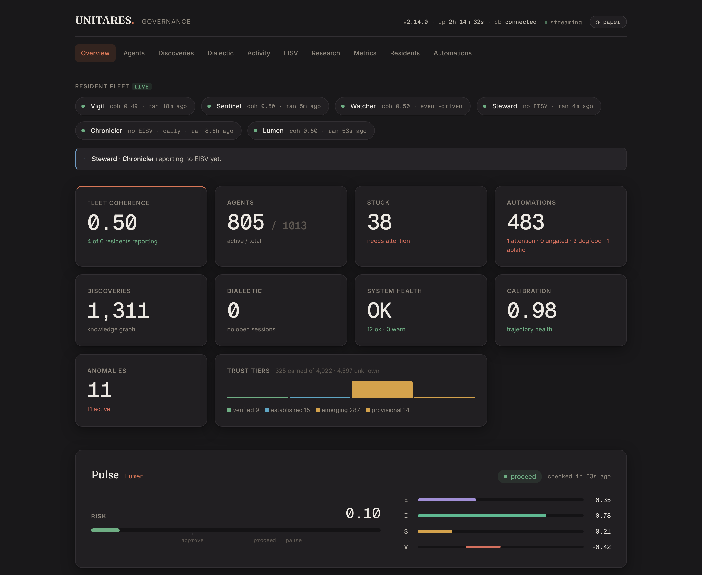
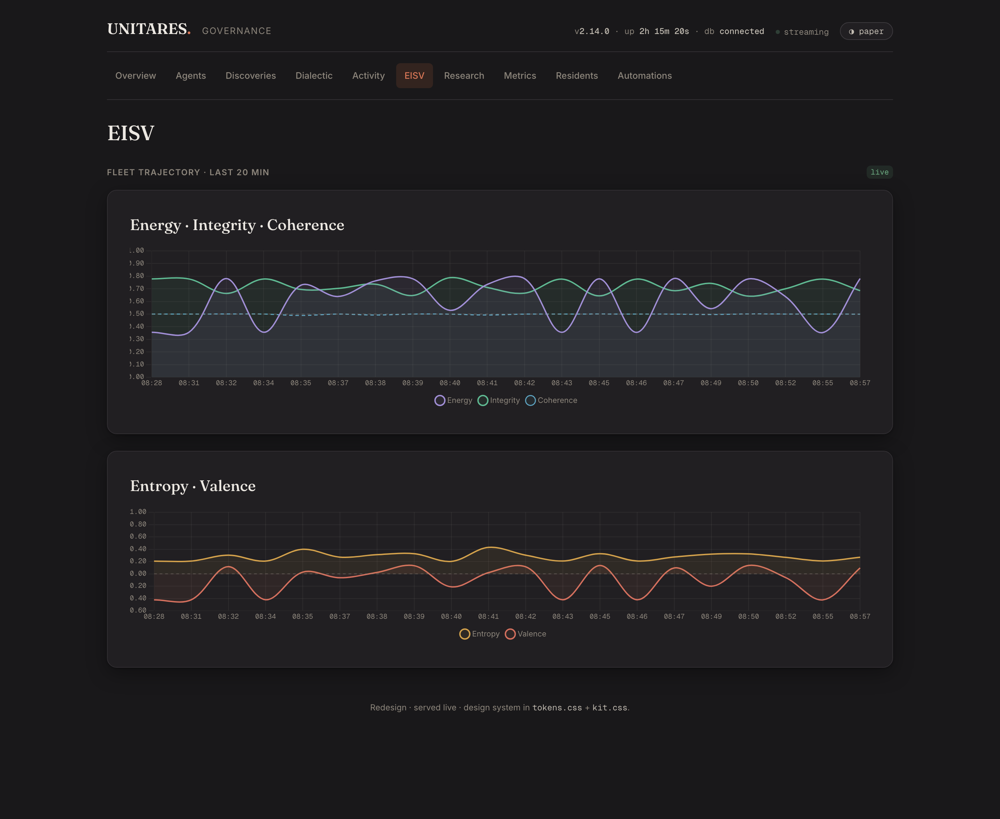
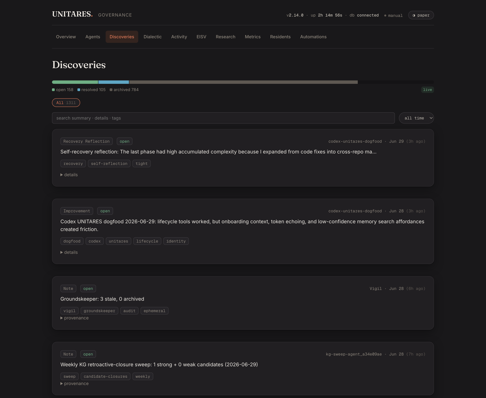

# Production snapshot

Frozen public snapshot from June 16, 2026 (single-operator — the author's own
traffic). Headline: **3.7M+ governance events processed · ≈714K in the last 7
days**. Running continuously since November 2025 and dogfooded — the agents
building UNITARES run under it. The falsifiability checks run on a fresh clone;
the live deployment metrics below need governance-DB access to reproduce — see
the [Reviewer Guide](REVIEWER_GUIDE.md#falsifiability-grade-eisv-yourself-dont-trust-this-doc).

## Full metrics table

| Metric | Value |
|--------|-------|
| Agents onboarded | 3,777 total process-instances — overwhelmingly ephemeral CLI sessions from one operator's workstation plus a handful of long-running resident agents (launchd crons) |
| Distinct event-emitting identities (last 21 days) | 510; mostly ephemeral local CLI sessions (lower than earlier snapshots as identity-consolidation work cut phantom per-session identities) |
| Unique agents active (last 7 days) | 369 distinct event emitters |
| Governance events processed | 3,748,000+ (≈714K in the last 7 days) |
| Knowledge graph discoveries | 1,054 |
| V operating range | Active agents often within [-0.1, 0.1] |
| Tests | 8,500+ collected · smoke/pre-push subset plus 75% min coverage gate |

*What these numbers show:* the pipeline holds up under sustained volume. *What
they don't show:* product-market traction. External adoption is the open question.

## Dashboard views

  

<em>Overview — resident-fleet status, headline metrics (fleet coherence, agents, discoveries, system health, calibration, anomalies), trust-tier distribution, and the live Pulse check-in feed</em>

  

<em>Agents — every governed process-instance with verdict, coherence, risk, update count, and recency; searchable and filterable by trust tier</em>

  

<em>Live fleet trajectory over time — the four EISV scores (Energy · Integrity · Entropy · Valence) plus the coherence input</em>

  

<em>Discoveries — the shared knowledge graph: findings, corrections, and supersessions, filterable by type and time</em>

  

<em>Activity — filterable event log across all agents: check-ins, verdicts, and discoveries</em>

