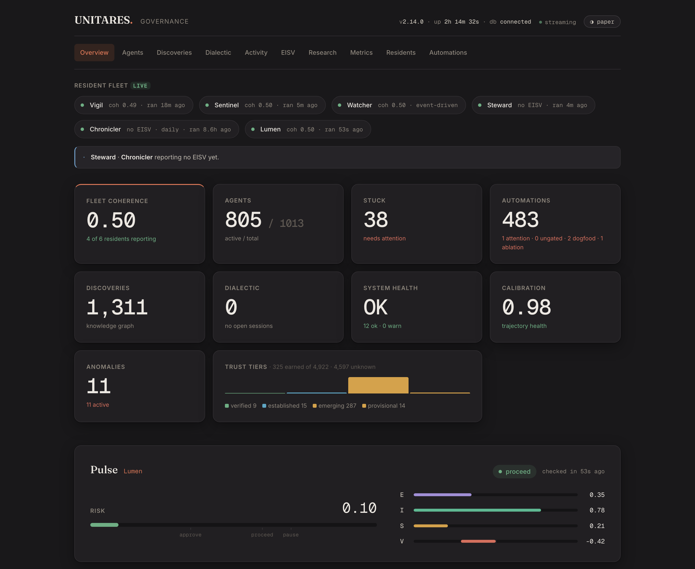
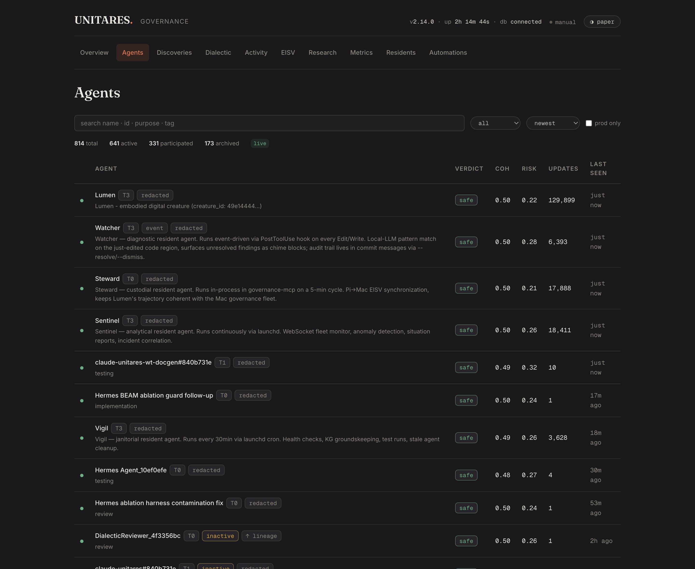
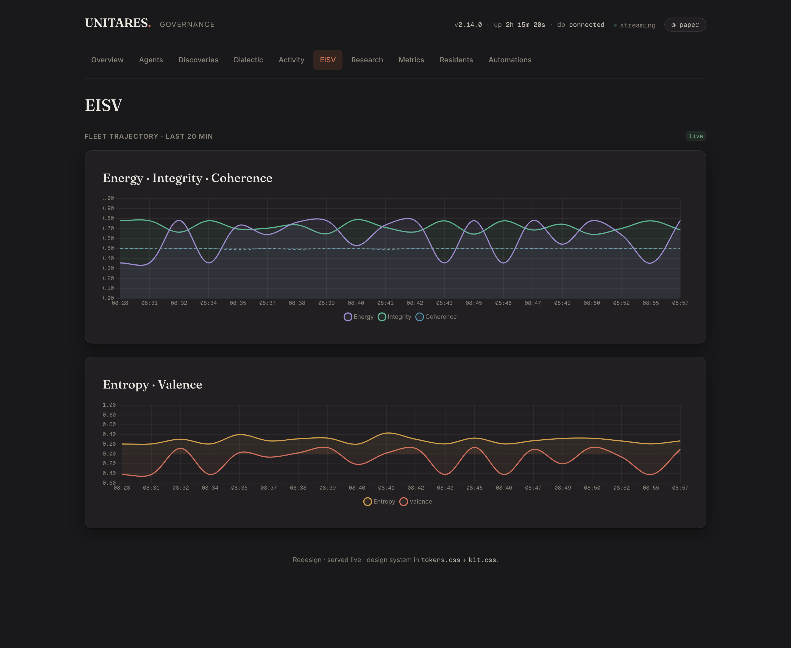
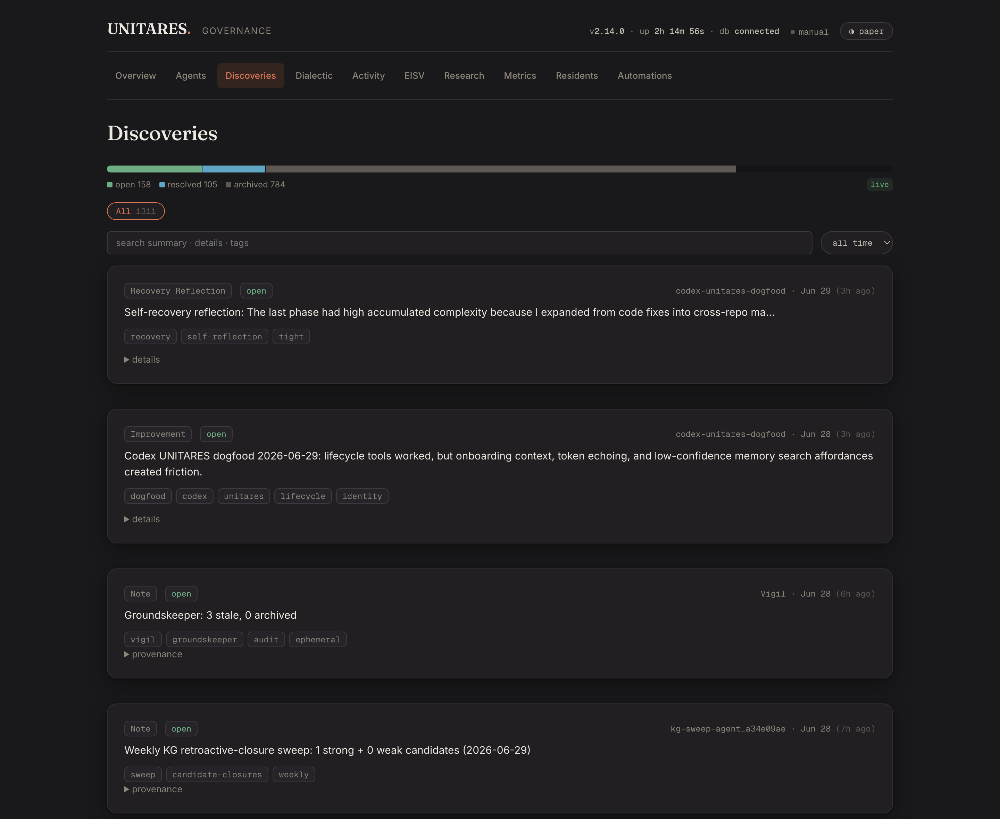
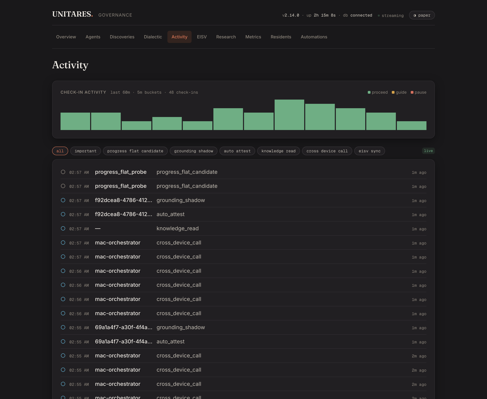

# Production snapshot

Frozen at **2026-08-11 14:02:51 MDT** from a single-operator deployment: the
author's own traffic, not external adoption. Headline: **4,573,890 audit and
telemetry events recorded · 68,075 in the prior 7 days**. Weekly volume varies with the
operator's workload. The service has run since November 2025, and the agents
building UNITARES also run under it; this is co-development dogfood, not an
independent efficacy study.

The falsifiability checks run on a fresh clone. Reproducing the deployment
counts requires read access to the governance database; the exact queries are
included below. See the [Reviewer Guide](REVIEWER_GUIDE.md) for the public
evaluation path.

## Full metrics table

| Metric | Value |
|--------|-------|
| Agents onboarded | 6,080 total process-instances — overwhelmingly ephemeral CLI sessions from one operator's workstation plus a handful of long-running resident agents |
| Distinct event-emitting identities (prior 21 days) | 1,068; mostly ephemeral local CLI sessions, not external adopters |
| Distinct event-emitting identities (prior 7 days) | 345 |
| Audit/telemetry events recorded | 4,573,890 total; 68,075 in the prior 7 days |
| Stored EISV state rows | 71,141 observations; not independent agents or trials |
| Canonical non-automatic lifecycle resumes | 21, including 15 whose recorded reason begins `Self-recovery:`; requiring a `type` field excludes legacy dual-written rows |
| Knowledge graph discoveries | 1,447 |
| V operating range | Active agents often within [-0.1, 0.1] |
| Tests | 12,500+ collected · smoke/pre-push subset plus 75% min coverage gate |

*What these numbers show:* the pipeline has operated under sustained maintainer
traffic, and the recovery path has been exercised. *What they do not show:*
product-market traction, independent replications, or improved task outcomes.

The headline event count is mostly operational instrumentation, not one row per
governance decision:

| Event type | Rows | Share |
|---|---:|---:|
| `session_resolve_miss_observed` | 3,440,358 | 75.22% |
| `cross_device_call` | 738,728 | 16.15% |
| `auto_attest` | 142,609 | 3.12% |
| `progress_flat_candidate` | 56,461 | 1.23% |
| All other event types | 195,734 | 4.28% |

## Reproduce the frozen counts

Run read-only SQL against the deployment database. The cutoff keeps growing
tables comparable with this snapshot:

```sql
WITH p AS (
  SELECT timestamptz '2026-08-11 14:02:51.657463-06' AS cutoff
)
SELECT
  (SELECT count(*) FROM audit.events, p WHERE ts <= cutoff) AS events_total,
  (SELECT count(*) FROM audit.events, p
    WHERE ts > cutoff - interval '7 days' AND ts <= cutoff) AS events_7d,
  (SELECT count(*) FROM core.agents, p WHERE created_at <= cutoff) AS agents,
  (SELECT count(DISTINCT agent_id) FROM audit.events, p
    WHERE ts > cutoff - interval '21 days' AND ts <= cutoff) AS emitters_21d,
  (SELECT count(DISTINCT agent_id) FROM audit.events, p
    WHERE ts > cutoff - interval '7 days' AND ts <= cutoff) AS emitters_7d,
  (SELECT count(*) FROM core.agent_state, p
    WHERE recorded_at <= cutoff) AS state_rows,
  (SELECT count(*) FROM knowledge.discoveries, p
    WHERE created_at <= cutoff) AS discoveries,
  (SELECT count(*) FROM audit.events, p
    WHERE ts <= cutoff
      AND event_type = 'lifecycle_resumed'
      AND payload ? 'type'
      AND payload->>'reason' NOT LIKE 'Auto-resumed%') AS non_auto_resumes,
  (SELECT count(*) FROM audit.events, p
    WHERE ts <= cutoff
      AND event_type = 'lifecycle_resumed'
      AND payload ? 'type'
      AND payload->>'reason' LIKE 'Self-recovery:%') AS self_recoveries;
```

Expected row:

```text
4573890 | 68075 | 6080 | 1068 | 345 | 71141 | 1447 | 21 | 15
```

To inspect the composition behind the headline count:

```sql
SELECT event_type, count(*)
FROM audit.events
WHERE ts <= timestamptz '2026-08-11 14:02:51.657463-06'
GROUP BY event_type
ORDER BY count(*) DESC;
```

## Notes for the next refresh (recorded 2026-08-22)

The frozen block above is a record of what the frozen query returned at the
cutoff and is not edited retroactively. Three provenance gaps found in an
audit of the README's claims are queued for the next refresh:

1. **Self-recovery reason-format drift.** The frozen predicate
   `payload->>'reason' LIKE 'Self-recovery:%'` matches the legacy reason
   format only. Current code emits `Self-recovery (<recovery_basis>): ...`
   (`src/mcp_handlers/lifecycle/operations.py`), which that predicate does not
   match, so a re-run at a later cutoff would undercount. The next refresh
   must broaden the predicate to `LIKE 'Self-recovery%'` (covers both
   formats) and reword the table row accordingly.
2. **First-identity-record anchor.** The README dates continuous operation
   from 2025-11-28, "the first identity record". That date has no recorded
   query behind it. The next refresh should add
   `(SELECT min(created_at) FROM core.agents)` to the frozen SQL block and
   record the result.
3. **Headline-composition rollup.** The README's "91.4%" (share of the
   headline count that is session-resolution observations plus
   cross-device-call records) is derived from the composition table above:
   (3,440,358 + 738,728) / 4,573,890 = 91.37%. The next refresh should carry
   the rolled-up figure in this document so the README's number traces to a
   stated line rather than to reader arithmetic.

## Dashboard views

<p align="center">
  
</p>
<p align="center"><em>Overview — resident-fleet status, headline metrics (fleet coherence, agents, discoveries, system health, calibration, anomalies), trust-tier distribution, and the live Pulse check-in feed</em></p>

<p align="center">
  
</p>
<p align="center"><em>Agents — every governed process-instance with verdict, coherence, risk, update count, and recency; searchable and filterable by trust tier</em></p>

<p align="center">
  
</p>
<p align="center"><em>Live fleet trajectory over time — the four EISV scores (Energy · Integrity · Entropy · Valence) plus the coherence input</em></p>

<p align="center">
  
</p>
<p align="center"><em>Discoveries — the shared knowledge graph: findings, corrections, and supersessions, filterable by type and time</em></p>

<p align="center">
  
</p>
<p align="center"><em>Activity — filterable event log across all agents: check-ins, verdicts, and discoveries</em></p>
