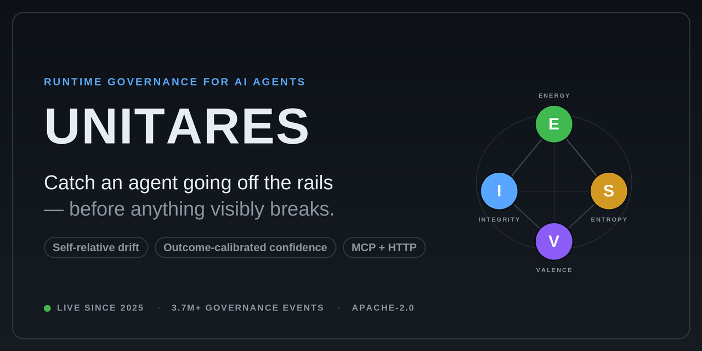

# Brand & visual assets

Shared visual language for UNITARES. Keep new diagrams and cards on this palette
so the README, hero, and social card read as one product.

## Social preview



`social-preview.png` is the card GitHub shows when the repo is linked on X,
LinkedIn, Slack, Discord, etc. **It is a repository setting, not part of the
README** — git can't set it. To apply it:

> **Settings → General → Social preview → Edit → Upload an image** → pick
> `docs/assets/social-preview.png`.

GitHub spec: 1280×640 px, PNG/JPG, ≥640×320, under 1 MB. This card is 1280×640.

Regenerate it after a copy or palette change:

```bash
python3 scripts/dev/gen_social_preview.py   # writes docs/assets/social-preview.png
```

The generator ([`scripts/dev/gen_social_preview.py`](../../scripts/dev/gen_social_preview.py))
renders at 2× and downsamples for crisp text/edges. It depends only on Pillow.

## Palette (GitHub dark)

| Role | Hex | Used for |
|---|---|---|
| Background top | `#0d1117` | canvas, node outlines |
| Background bottom | `#161b22` | gradient base |
| Border | `#30363d` | card edge, chips, orbital ring |
| Ink | `#e6edf3` | primary text / wordmark |
| Subtle | `#8b949e` | secondary text, captions |
| Faint | `#484f58` | separators |
| Accent | `#58a6ff` | eyebrow, links, the **I** node |
| **E** Energy | `#3fb950` | green node |
| **I** Integrity | `#58a6ff` | blue node |
| **S** Entropy | `#d29922` | amber node |
| **V** Valence | `#8b5cf6` | violet node |

The **EISV diamond** (E top, I left, S right, V bottom) is the recognizable
mark — it appears in both [`hero.svg`](hero.svg) and the social card. Reuse it
rather than inventing new iconography.

Type: system sans (`system-ui` in SVG; Liberation Sans when rasterizing).

## Asset inventory

| File | What | Where it's used |
|---|---|---|
| `hero.svg` | Banner wordmark + EISV diamond | README hero |
| `social-preview.png` | 1280×640 share card | repo social-preview setting |
| `dashboard-overview.png` | Overview — fleet, metrics, trust tiers, Pulse | Production snapshot |
| `dashboard-agents.png` | Agents — per-instance verdict/coherence/risk | Production snapshot |
| `dashboard-eisv.png` | EISV — live fleet trajectory charts | Production snapshot |
| `dashboard-discoveries.png` | Discoveries — shared knowledge graph | Production snapshot |
| `dashboard-activity.png` | Activity — filterable event log | Production snapshot |
